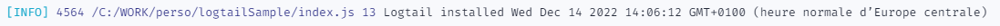

# logtailSample

This sample is used as HowTo reproduce logtail behaviors.

## Setup (one time only)

Setup your logtail secret:

```bash
export CH_LOGTAIL_SOURCE=blahblahblah
```

## Normal use

Try classic usage

```bash
node index.js
```

This works! you could see the result in your https://logtail.com/ `Live tail` :


## Mocha use case

To do a test with mocha test framework with `@logtail/node` or `@logtail/js`.

```bash
npm run test
```

2 `Live tail` additional entries added.


## Circular reference use case

To do a test with circular reference as context object

```bash
node tests/logtailNode_MaxStackIssue.js
```

- A first entry is well sent with a simple json object.
- A Second entry produces `RangeError: Maximum call stack size exceeded` issue: log is NOT sent.